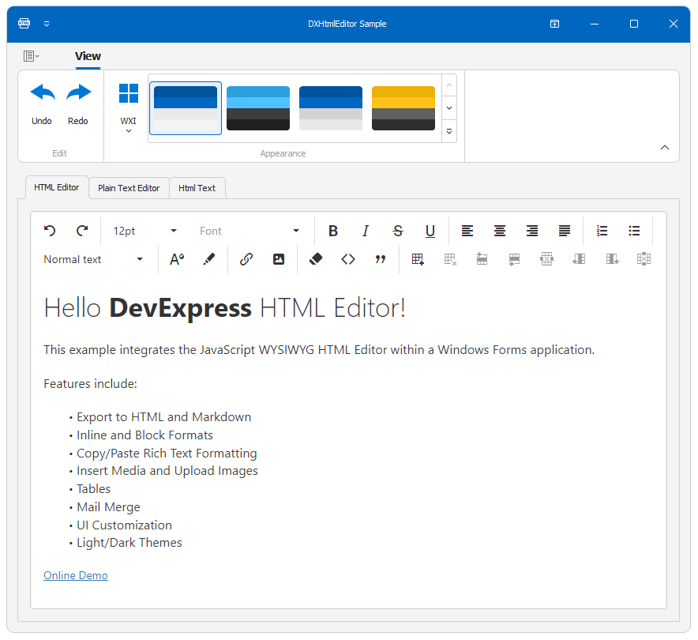

<!-- default badges list -->

[](https://supportcenter.devexpress.com/ticket/details/T1223158)
[](https://docs.devexpress.com/GeneralInformation/403183)
<!-- default badges end -->

# Integrate JavaScript HTML Editor into a WinForms App

This example integrates the JavaScript WYSIWYG HTML Editor (a components that ships as part of [DevExteme UI component suite](https://js.devexpress.com)) within a WinForms application. The client-side HTML Editor is embedded into the Microsoft Edge WebView2 control (`DXHtmlEditorWebView`).



## HTML Editor Features

- HTML and Markdown Support
- HTML Editor features include:
- Inline and Block Formats
- Copy/Paste Rich Text Formatting
- Insert Media and Upload Images
- Tables
- Mail Merge
- UI Customization
- Light/Dark Themes

> Note
> -	Using DevExpress JavaScript HTML Editor within your desktop application requires an active [DevExtreme license](https://www.devexpress.com/buy/js/).
> -	The DevExtreme HTML Editor does not support all HTML-related features and tags ([read about limitations](https://js.devexpress.com/Angular/Documentation/Guide/UI_Components/HtmlEditor/Overview/)).

The example also implements the following:

- Auto-syncs the WinForms application skin with the HTML Editor’s theme. When switching from a dark to a light color palette (and vice versa), the corresponding theme (dark or light) is applied to the HTML Editor.
- Undo/Redo Ribbon commands allow users to revert or redo actions within the HTML Editor.

## Use the HTML Editor in Your WinForms App

1. Copy the `DXHtmlEditor` folder to your project.
2. Install the `Microsoft.Web.WebView2` NuGet package.
3. Open the *DXHtmlEditorClient.cs* file and specify the default namespace within the `OnWebResourceRequested` method:
   ```csharp
   void OnWebResourceRequested(object sender, CoreWebView2WebResourceRequestedEventArgs e) {
    var environment = webView?.Environment;
    if(environment == null)
        return;
    string asset = $@"{nameof(MyDefaultNamespace)}.{nameof(DXHtmlEditor)}.Assets.{e.Request.Uri.Substring(rootURIFilter.Length - 1)}";
    // ...
   }
   ```
4. Set **Build Action** to "Embedded Resource" for all files in the Assets folder.
5. Build the solution.
6. Drop the `DXHtmlEditorWebView` component from the toolbox onto a form.

## Files to Review

- [DXHtmlEditorClient.cs](./CS/DXHtmlEditor/DXHtmlEditorClient.cs)
- [DXHtmlEditorWebView.cs](./CS/DXHtmlEditor/DXHtmlEditorWebView.cs)
- [MainForm.cs](./CS/MainForm.cs)
- [index.js](./CS/DXHtmlEditor/Assets/index.js)

## See Also

[Integrate the DevExtreme JavaScript HTML Editor into a WinForms Application (Blog Post)](https://community.devexpress.com/blogs/winforms/archive/2024/03/18/integrate-devextreme-javascript-html-editor-into-winforms-app.aspx)
